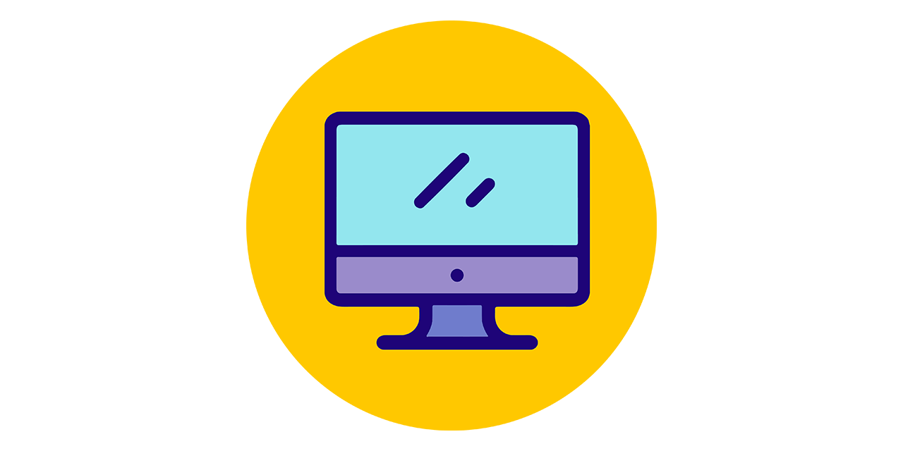

# Study Plan: Software Engineering / Computer Science
_**Author:** Brandon Peebles_

Image from https://www.clipartkey.com/view/ohhmhm_computer-science-and-engineering-computer-science-icon-circle/

## What is this?

This living document is my study plan for computer science and software engineering topics.  Given my previous experience in analytics/operations plus education in industrial & systems engineering, it’s been customized to fill specifically my knowledge gaps and prepare me for a role in software engineering. It outlines what I’m covering as well as serves as a way to track my progress.

---

## Completed:
* **CS50x:** Introduction to Computer Science [link](https://cs50.harvard.edu/x/2020/) - Completed June 13th, 2020

## In progress:
* **freeCodeCamp** ([link](https://www.freecodecamp.org/learn))  - June 13th, 2020 — Present
	- [ ] Responsive Web Design _(in progress)_
	- [ ] JavaScript Algorithms and Data Structures (TBD - may replace with Python course instead)
	- [ ] Front End Libraries (Bootstrap, jQuery, Sass, React, Redux)
	- [ ] Data Visualization (D3, JSON APIs and Ajax)
	- [ ] APIs and Microservices (Npm, Node, Express, MongoDB, Mongoose)
	- [ ] Information Security and Quality Assurance (HelmetJS, QA and Testing with Chai, Advanced Node & Express)
*  **Overview of Operating Systems:**
	- [ ] [Operating Systems Concepts 10th Edition](https://www.amazon.com/Operating-System-Concepts-Abraham-Silberschatz-ebook/dp/B07CVKH7BD)) 
	- [ ] [Berkeley CS 162 Operating Systems - 24 videos](https://www.youtube.com/playlist?list=PLRdybCcWDFzCag9A0h1m9QYaujD0xefgM)
* **Overview of Computer Processing & Architecture:**
	- [ ] [How CPU executes a program (video)](https://www.youtube.com/watch?v=XM4lGflQFvA)
	- [ ] [How computers calculate - ALU (video)](https://youtu.be/1I5ZMmrOfnA)
	- [ ] [Registers and RAM (video)](https://youtu.be/fpnE6UAfbtU)
	- [ ] [The Central Processing Unit (CPU) (video)](https://youtu.be/FZGugFqdr60)
	- [ ] [Instructions and Programs (video)](https://youtu.be/zltgXvg6r3k)
* **[Crash Course: Computer Science - 41 videos: ](https://www.youtube.com/playlist?list=PL8dPuuaLjXtNlUrzyH5r6jN9ulIgZBpdo)** Really great overview video series about computer science history, computer architecture, languages, internet, and more.

## Up next:
* **Overview of Discrete Mathematics:**
	- [ ] Introductory Discrete Mathematics (book) - read for general knowledge
	- [ ] [Intro to Discrete Math - 79 videos to watch for general knowledge] (https://www.youtube.com/watch?v=rdXw7Ps9vxc&list=PLHXZ9OQGMqxersk8fUxiUMSIx0DBqsKZS)
	
* **Data Structures & Algorithms:**  
	* Mostly following the structure of a study guide created by John Washam ([link](https://github.com/jwasham/coding-interview-university))
	* Will update this section later with more specifics on what I'll be covering + resources to be used.

## To be prioritized:
* Flask Web Development 2nd Edition ([book](https://www.amazon.com/Flask-Web-Development-Developing-Applications/dp/1491991739/ref=pd_lpo_14_img_0/142-6800639-6536255?_encoding=UTF8&pd_rd_i=1491991739&pd_rd_r=18257858-20bf-4d05-91af-46f001c44dfe&pd_rd_w=sVulb&pd_rd_wg=YiOH2&pf_rd_p=7b36d496-f366-4631-94d3-61b87b52511b&pf_rd_r=ZBGRKWTX74NP7Z094FKY&psc=1&refRID=ZBGRKWTX74NP7Z094FKY)) (TBD - may prioritize Node.JS instead)
* Clean Code ([book](https://www.amazon.com/Clean-Code-Handbook-Software-Craftsmanship/dp/0132350882/ref=sr_1_2?dchild=1&keywords=clean+code&qid=1592159304&s=books&sr=1-2))
* Cracking the Coding Interview 6th Edition ([book](https://www.amazon.com/Cracking-Coding-Interview-Programming-Questions/dp/0984782850/ref=sr_1_2?crid=17NX867ZGASZA&dchild=1&keywords=cracking+the+coding+interview&qid=1592159325&s=books&sprefix=cracking%2Cstripbooks%2C139&sr=1-2))

## Other resources:
* **Coding Interview University:**  Many of the links/books/resources/topics above I've selected from a study guide created by John Washam ([link](https://github.com/jwasham/coding-interview-university)). Big shoutout to him for his in-depth guide on what to study!
* Books
	* Data Structures & Algorithms in Python
	* Learning Python 5th Edition
	* The UNIX Programming Environment
	* The C Programming Language 2nd Edition
* Websites
	* LeetCode ([link](https://leetcode.com))
